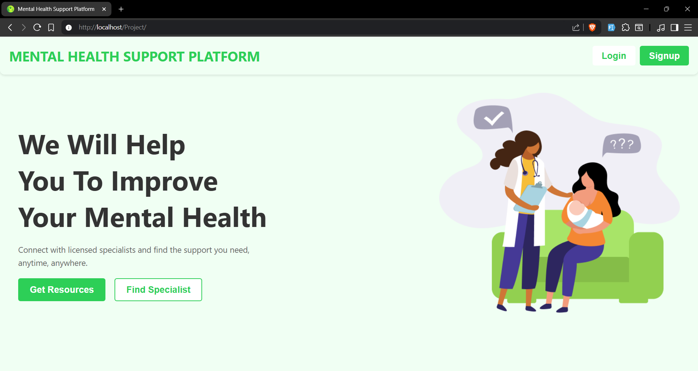
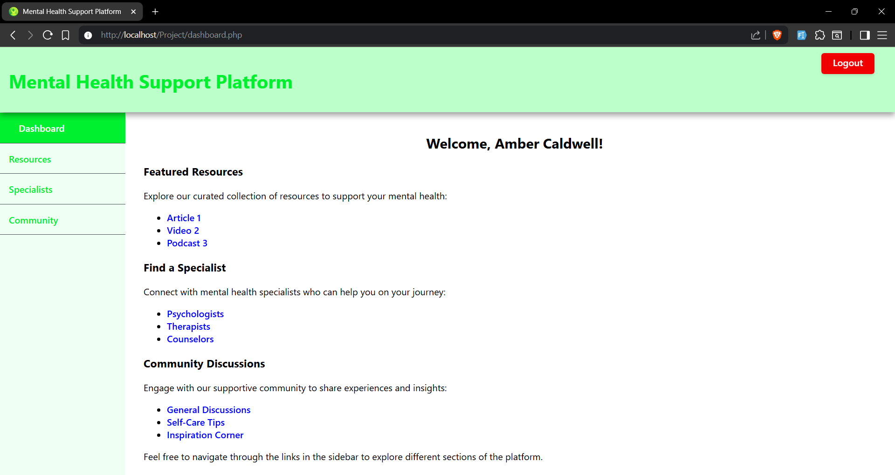
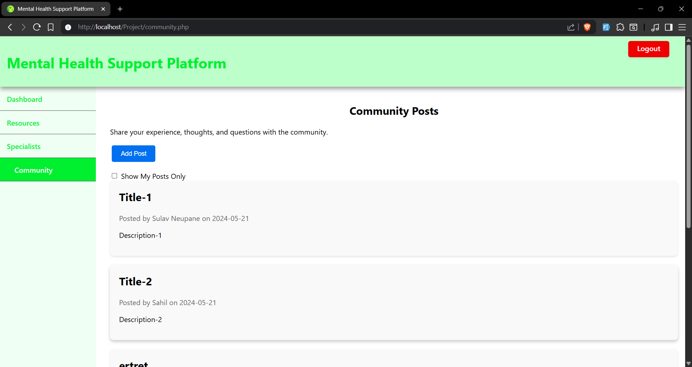
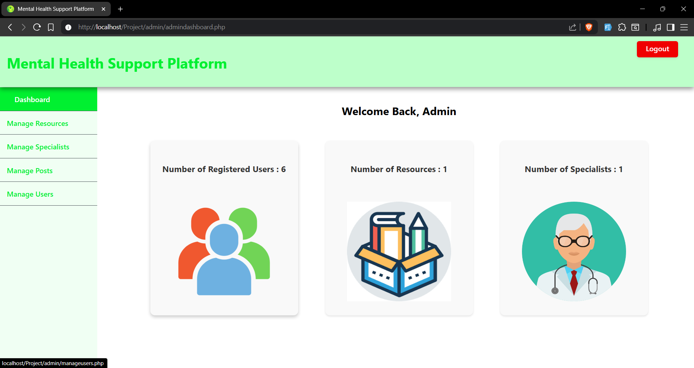

# 🧠 Mental Health Support Platform

<div align="center">
  
  
  [](https://php.net)
  [](https://mysql.com)
  [](https://javascript.com)
  [](https://html.spec.whatwg.org)
  [](https://www.w3.org/Style/CSS)

  <h3>💙 Connect with licensed specialists and find the support you need, anytime, anywhere 💙</h3>
</div>

## 📋 Table of Contents

- [About](#about)
- [Features](#features)
- [Screenshots](#screenshots)
- [Installation](#installation)
- [Usage](#usage)
- [Database Schema](#database-schema)
- [Project Structure](#project-structure)
- [Technologies Used](#technologies-used)
- [Contributing](#contributing)

## 🌟 About

The **Mental Health Support Platform** is a comprehensive web application designed to provide accessible mental health resources and support to users. This platform bridges the gap between individuals seeking mental health assistance and professional care providers, creating a supportive community environment.

### 🎯 Mission

To make mental health support accessible, reduce stigma, and create a safe space for individuals to find resources, connect with professionals, and share their experiences.

## ✨ Features

### 👤 User Features

- **🔐 User Authentication System**
  - Secure user registration and login
  - Password hashing and validation
  - Session management
- **📚 Resource Library**
  - Curated mental health resources
  - Articles, videos, and educational content
  - Categorized content for easy navigation
- **👨‍⚕️ Find Specialists**
  - Browse licensed mental health professionals
  - View specialist profiles with contact information
  - Filter by profession (Psychologists, Therapists, Counselors)
- **💬 Community Support**
  - Share personal experiences and stories
  - Engage with supportive community members
  - Filter and view your own posts
  - Interactive discussion platform

### 🔧 Admin Features

- **📊 Admin Dashboard**
  - Real-time statistics and analytics
  - User, resource, and specialist counts
  - Visual dashboard with interactive elements
- **👥 User Management**
  - View all registered users
  - Delete user accounts
  - Monitor user activity
- **📖 Resource Management**
  - Add, update, and delete resources
  - Categorize content effectively
  - Link management and validation
- **👨‍⚕️ Specialist Management**
  - Add new mental health professionals
  - Update specialist information
  - Remove outdated profiles
- **💭 Community Moderation**
  - Monitor community posts
  - Delete inappropriate content
  - Maintain community guidelines

## 🖼️ Screenshots

### Landing Page



### User Dashboard



### Community Platform



### Admin Panel



## 🚀 Installation

### Prerequisites

- **XAMPP** (Apache, MySQL, PHP)
- **Web Browser** (Brave, Chrome, Edge, etc.)
- **Text Editor/IDE** (VS Code, Sublime Text, etc.)

### Step-by-Step Setup

1. **Clone the Repository**

   ```bash
   git clone https://github.com/olrightythen/Mental-Health-Support-Platform.git
   cd Mental-Health-Support-Platform
   ```

2. **Setup XAMPP Environment**

   - Install and start XAMPP
   - Start Apache and MySQL services
   - Copy project folder to `C:\xampp\htdocs\`

3. **Database Configuration**

   - Open phpMyAdmin (`http://localhost/phpmyadmin`)
   - Create a new database named `mhsp`
   - Import the SQL file:
     ```sql
     -- Import the mhsp.sql file provided in the project
     ```

4. **Configure Database Connection**

   - Update database credentials in PHP files if needed:
     ```php
     $conn = mysqli_connect("localhost", "root", "", "mhsp");
     ```

5. **Access the Application**
   ```
   http://localhost/Project/
   ```

### Default Admin Credentials

- **Username:** admin
- **Password:** administrator

## 📖 Usage

### For Users

1. **Registration**: Create a new account with name, email, and password
2. **Login**: Access your personalized dashboard
3. **Browse Resources**: Explore curated mental health content
4. **Find Specialists**: Search for mental health professionals
5. **Community Participation**: Share experiences and support others

### For Administrators

1. **Admin Login**: Use admin credentials to access admin panel
2. **Dashboard Overview**: Monitor platform statistics
3. **Content Management**: Add/update resources and specialists
4. **User Moderation**: Manage users and community posts
5. **System Maintenance**: Ensure platform quality and safety

## 🗄️ Database Schema

### Tables Overview

- **`users`**: User account information and authentication
- **`admins`**: Administrator credentials
- **`resources`**: Mental health resources and educational content
- **`specialist`**: Mental health professional profiles
- **`experiences`**: Community posts and user experiences

### Key Relationships

- Users can create multiple community posts (experiences)
- Foreign key constraints maintain data integrity
- Proper indexing for optimal performance

## 📁 Project Structure

```
Mental-Health-Support-Platform/
├── 📁 admin/                    # Admin panel files
│   ├── 📄 admindashboard.php   # Admin dashboard
│   ├── 📄 adminlogin.php       # Admin authentication
│   ├── 📄 manageusers.php      # User management
│   ├── 📄 manageresources.php  # Resource management
│   ├── 📄 managespecialist.php # Specialist management
│   └── 📄 manageposts.php      # Post moderation
├── 📁 assets/                   # Fonts and static assets
├── 📁 components/              # Reusable PHP components
│   ├── 📄 navfixed.php        # User navigation
│   ├── 📄 adminnavfixed.php   # Admin navigation
│   └── 📄 delete.php          # Delete functionality
├── 📁 css/                     # Stylesheets
│   ├── 📄 style.css           # Main styles
│   ├── 📄 admin.css           # Admin panel styles
│   ├── 📄 form.css            # Form styles
│   ├── 📄 home.css            # Landing page styles
│   └── 📄 user.css            # User dashboard styles
├── 📁 images/                  # Image assets
├── 📁 js/                      # JavaScript files
├── 📄 index.php               # Landing page
├── 📄 login.php               # User login
├── 📄 register.php            # User registration
├── 📄 dashboard.php           # User dashboard
├── 📄 resources.php           # Resources page
├── 📄 specialist.php          # Specialists directory
├── 📄 community.php           # Community platform
├── 📄 mhsp.sql               # Database schema
└── 📄 README.md              # Project documentation
```

## 🛠️ Technologies Used

### Backend

- **PHP 8.x**: Server-side programming
- **MySQL**: Database management
- **Apache**: Web server

### Frontend

- **HTML5**: Semantic markup
- **CSS3**: Modern styling and layouts
- **JavaScript**: Interactive functionality
- **Responsive Design**: Mobile-friendly interface

### Security Features

- **Password Hashing**: Secure password storage
- **SQL Injection Prevention**: Prepared statements
- **Input Validation**: Client and server-side validation
- **Session Management**: Secure user sessions

### Development Tools

- **XAMPP**: Local development environment
- **phpMyAdmin**: Database administration
- **Git**: Version control

## 🤝 Contributing

We welcome contributions to improve the Mental Health Support Platform! Here's how you can help:

### Ways to Contribute

1. **Bug Reports**: Report issues and bugs
2. **Feature Requests**: Suggest new features
3. **Code Contributions**: Submit pull requests
4. **Documentation**: Improve documentation
5. **Testing**: Help test new features

### Development Guidelines

1. Fork the repository
2. Create a feature branch (`git checkout -b feature/AmazingFeature`)
3. Commit your changes (`git commit -m 'Add some AmazingFeature'`)
4. Push to the branch (`git push origin feature/AmazingFeature`)
5. Open a Pull Request

### Code Standards

- Follow PSR-12 coding standards for PHP
- Use meaningful variable and function names
- Comment your code appropriately
- Test your changes thoroughly

## 🏥 Mental Health Resources

### Professional Help

If you're experiencing mental health challenges, please consider reaching out to:

- Licensed therapists and counselors
- Mental health professionals in your area
- Your healthcare provider
- Mental health hotlines

## 🙏 Acknowledgments

- Mental health professionals who inspire this work
- The open-source community for valuable resources
- Contributors and testers who make this platform better
- Everyone working to reduce mental health stigma

## 📞 Support

If you need help with the platform or have questions:

- 📧 **Email**: [sulavneupane1905@example.com]
- 🐛 **Issues**: [GitHub Issues](https://github.com/olrightythen/Mental-Health-Support-Platform/issues)
- 💬 **Discussions**: [GitHub Discussions](https://github.com/olrightythen/Mental-Health-Support-Platform/discussions)

---

<div align="center">
  <h3>💙 Remember: It's okay to not be okay. Seeking help is a sign of strength, not weakness. 💙</h3>
  
  **Made with ❤️ for mental health awareness**
  
  [⬆ Back to Top](#-mental-health-support-platform)
</div>
